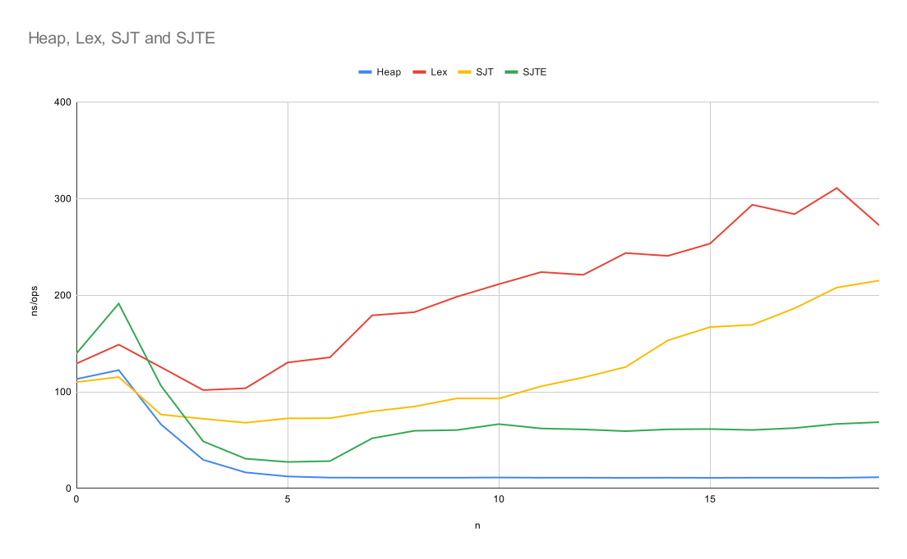
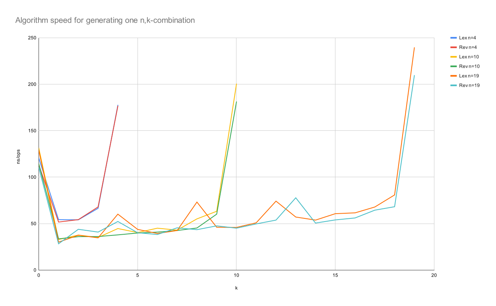

[](https://godoc.org/github.com/etnz/permute)

golang package 'permute' provides a tools to deal with 
[permutations](https://en.wikipedia.org/wiki/Permutations), 
[combinations](https://en.wikipedia.org/wiki/Combination)
.

It is very frequent to have to loop over all permutations or combinations of a set of items,
this package provides ways to make it simple.


Caveat: the number of permutations grows as fast as `n!` with the number of items to permute, 
and past `20` items the number of permutations is much greater than `MaxUint64`. Looping over all of them 
is impractical.

For the remaining practical cases, speed can still be critical though, and there are different ways to generate permutations or combinations.
This package offers multiple algorithms each one being best at something:
- generation speed
- memory efficiency
- generation order
   - [minimal changes](https://en.wikipedia.org/wiki/Permutation#Generation_with_minimal_changes)
   - lexicographical

See [Examples](https://godoc.org/github.com/etnz/permute#pkg-examples) or directly the [godoc](https://godoc.org/github.com/etnz/permute) for more details.


# Definitions

## permutations

A n-permutation is:

- a `[]int` of length `n`
- where each values are **unique**  *and* in the interval `[0, n[`

[Permutation example](https://pkg.go.dev/github.com/etnz/permute#example-Permute):

```go
// For a given set 'x'.
	x := []string{"a", "b", "c"}
	// The permutation 'p'
	p := []int{2, 1, 0}
	// transform 'x' into: `{x[2], x[1], x[0]}`
	Permute(p, x)
	fmt.Printf("%#v", x)
	//Output: []string{"c", "b", "a"}
```

## Combinations

A (n,k)-combination or (n,k)-subset is:

- a `[]int` of length `k`
- where each values are **unique**  *and* in the interval `[0, n[`
- values are sorted  in ascending order.

[Combination example](https://pkg.go.dev/github.com/etnz/permute#example-Subset):

```go
	// For a given set 'x'.
	x := []string{"a", "b", "c"}
	// The combination 'c'
	c := []int{0,2}
	// transform 'x' into: `{x[2], x[0]}`
	x=Subset(c, x)
	fmt.Printf("%#v", x)
	//Output: []string{"a", "c"}
```


# Permutation Generation

[Permutations example](https://pkg.go.dev/github.com/etnz/permute#example-Permutations):

```go
	// For a given set 'x'.
	x := []string{"a", "b", "c"}

	// One can simply loop over all permutations.
	for _, p := range Permutations(x) {
		fmt.Println(p)
	}
	//Output:
	// [a b c]
	// [b a c]
	// [c a b]
	// [a c b]
	// [b c a]
	// [c b a]
```

This package offers several other methods to generate all permutations:
  - **Lexicographical Order**: Generates all permutation in lexicographical order. This is not the fastest way to generate permutations, 
    and two successives permutation can differ by mmultiple transpositions.
  - **Steinhaus-Johnson-Trotter**: Generates all permutation with [minimal changes](https://en.wikipedia.org/wiki/Permutation#Generation_with_minimal_changes) and minimal memory consumption,
    using the the [Steinhaus-Johnson-Trotter](https://en.wikipedia.org/wiki/Steinhaus%E2%80%93Johnson%E2%80%93Trotter_algorithm).
  - **Even Speedup**: like Steinhaus-Johnson-Trotter but with a little speed up at the expense of a O(n) extra memory (but 'n' is always very small here).
  - **Heap**: generates all permutation  with [minimal changes](https://en.wikipedia.org/wiki/Permutation#Generation_with_minimal_changes) and minimal memory consumption 
    using the [Heap's Algorithm](https://en.wikipedia.org/wiki/Heap%27s_algorithm). This is the default implementation, and the fastest. The only limit is that the last element of the loop
    cannot be transformed into the first one with one single transposition (like with Steinhaus-Johnson-Trotter algorithm).

## Benchmarks

Benchmark are available to compare permutations generation algorithms




# Combination Generation

[Combinations example](https://pkg.go.dev/github.com/etnz/permute#example-Combinations):

```go
	// For a given set 'x'.
	x := []string{"a", "b", "c"}

	// One can simply loop over all 2-combinations.
	for v := range Combinations(2, x) {
		fmt.Println(v)
	}
	//Output:
	// [a b]
	// [b c]
	// [a c]
```

This package also offers several other methods to generate all combinations:
  - **Lexicographical Order**: Generates all combinations in lexicographical order. This is not the fastest one,
    and two successives combinations can differ by mmultiple transpositions.
  - **Revolving Door**: Generates all combinations in minimal change order using the [Revolving Door Algorithm](https://books.google.fr/books?id=0ArDOdcWNQcC&lpg=PA48&ots=JEsy6Hgdio&dq=revolving%20door%20algorithm&pg=PA49#v=onepage&q=revolving%20door%20algorithm&f=false). This is the default algorithm.


## Benchmarks

Benchmark are available to compare combinations generation algorithms




# Still on the workbench


- generating permutation by derangements (Lynn Yarbrough)
- generating combination with strong minimal change
- generating combination with adjacent Interchange
- generate integer partitions
